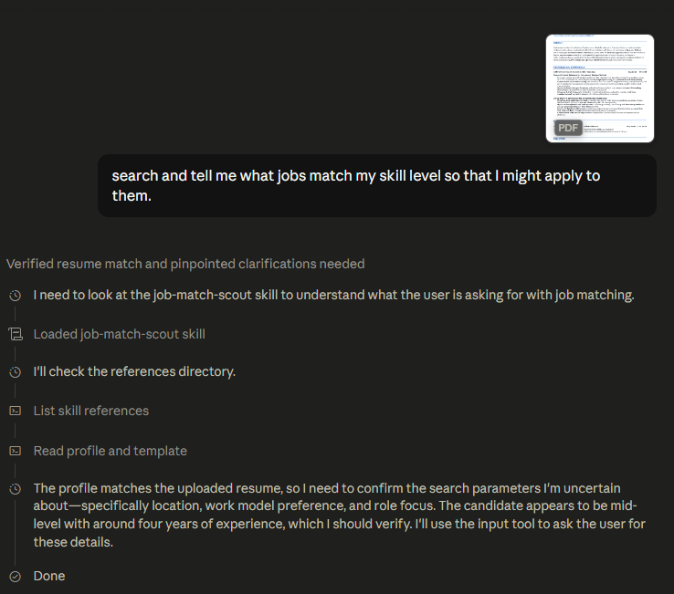

# Task 1 — Job Match Scout

## Problem Statement
Searching for various jobs on different platforms (Indeed, Glassdoor, LinkedIn etc.) is a bit monotonous for me and time taking as well. Also, with so many job requirements it is difficult to see and analyze how much I match against it.
For this problem, I had Claude create a skill for me that searches for jobs matching my resume on all the major platforms. And more importantly, I asked it to generate a report by matching my skills/resume with the requirements and tell me where I am a strong contender and where I am lacking.
I provided this prompt to Claude and it generated the skill named “job-match-scout” and I saved it.
> I am uploading my resume in pdf format. Now create a skill that will connect to LinkedIn, Indeed, Glassdoor and it will search for the jobs relevant to my skills and resume. Also, mention the skill matching in the report so that my profile will be matched with the description and job requirements and tell me what are strong matches, where my profile suits the job and what are the shortcomings in my resume with respect to the job requirements and specifications.

## Proof of the Skill in Action

