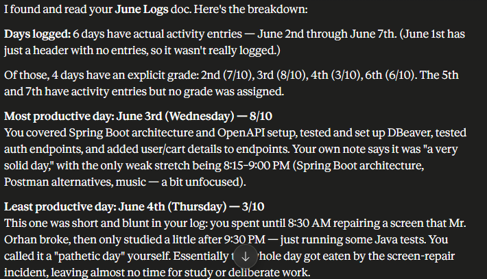

I connected Claude to my Gmail and Drive and asked it questions regarding one of my doc files in the drive folder (named June Logs). It contains my activity monitor, like what I did with my day, how I spent my free time, what did I accomplish etc. And Claude answered me very accurately.
The access granted was just a read access and for the purpose of the assignment I did not really need to provide a write access to that particular file.
I connected **Google Drive** to Claude and pasted the following prompt.

> There is a file in my Google Drive named June Logs. The document stores my activity log, at what time I did what for each day. It helps me keep track of where I spent my time. At the end, I assign a grade to each day indicating how much productive the day was and what I accomplished on that day. Read the file, tell me for how many days I kept a log of my activities and time and what was the most productive and the least productive day? On the least productive day, what went wrong and where did I spend my time? YOu can only read the file, no changes are allowed.

## Proof of Claude reading the file from Google Drive
