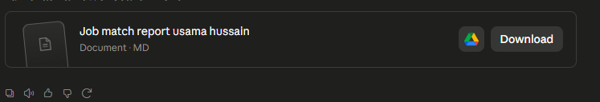
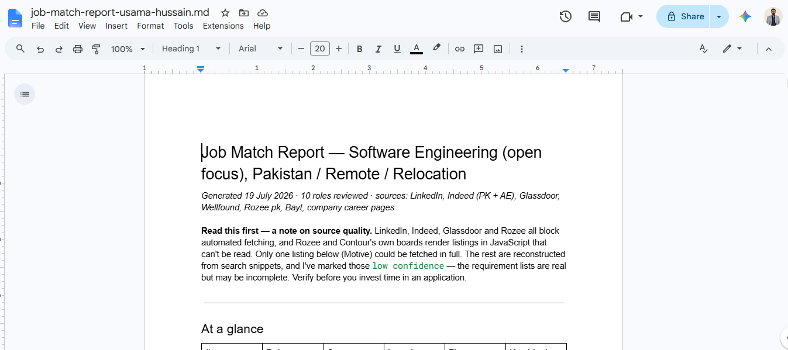

I gave the following prompt to Claude.

> search and tell me what jobs match my skill level so that I might apply to them..

And it loaded my skill, searched for jobs on the major platforms and generated an entire report, even though I never mentioned generating the report. I opened the report in Google Drive and downloaded it.

## Proof of Claude generating the report file and reading from Google Drive

